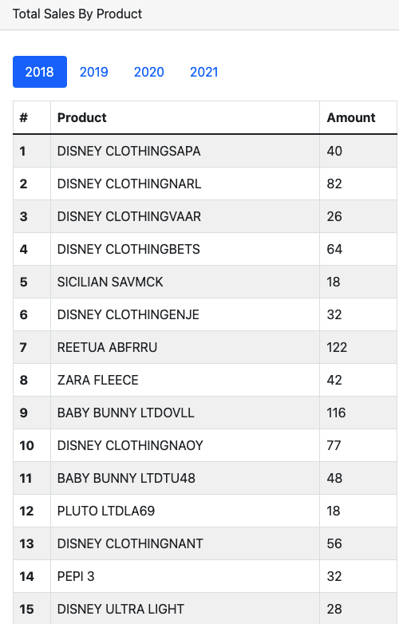
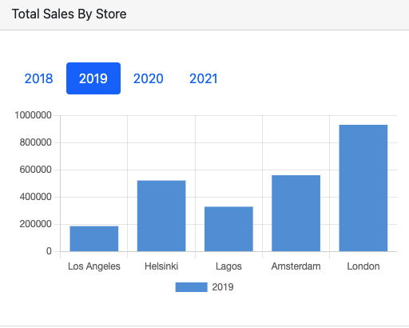

## About The Assignment





Build a full stack web application allowing users to upload csv file and display the results in a form of reports and charts.

Based on the requirements and the given dataset, the Sales entity is designed to have the following properties: "datetime", "store", "category", "product", "amount", "currency" that can be instantiated and inserted to database when user upload the file.

The SalesReport and the Report entities are mainly for holding and parsing data into JSON that is sent to the client.

The UploadFileController is designed to handle different types of data provided by different companies.

Vuejs and Chartjs are used to build up the visulization of the application. Since there are more than 20 products are sold each year, a table is chosen to provide clearer and neater insights of the dataset while a bar chart is used for displaying information by stores.

## Technologies

- [Vue.js](https://vuejs.org/)
- [Bootstrap](https://getbootstrap.com)
- [Chartjs](https://www.chartjs.org/docs/latest)
- [Scala / Play Framework](https://www.playframework.com)
- [Scala Slick / SQL](https://scala-slick.org)
- [Docker](https://www.docker.com)

## Getting Started

To get a local copy up and running follow these simple steps.

### Prerequisites

Make sure you have npm, suitable Jave JDK and sbt installed on your local machine.

### Installation

#### _Front-end_

1. Go into client folder and install NPM packages

```sh
  npm install
```

2. Run the app. By default, app is running at [http://localhost:8080](http://localhost:8080)

```sh
  npm run serve
```

#### _Back-end_

1. Go into server folder and run docker to start database service

```sh
  docker compose up -d
```

2. Download dependencies and start server. By default, server is running at [http://localhost:9000](http://localhost:9000)

```sh
  sbt run
```
